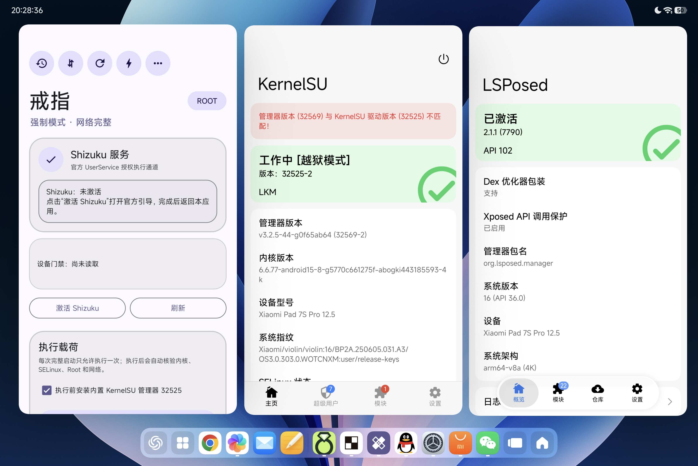

<div align="center">

# ⚡ IonStack Violin

**CVE-2026-43499 内核提权研究 — Xiaomi Pad 7S Pro**

---


-green?logo=android)


[English](README_EN.md)

</div>

---

## 项目简介

本项目是对 **CVE-2026-43499**（代号 GhostLock / IonStack）在 **小米平板7S Pro**（代号 `violin`）上的内核提权链研究。

- **目标设备：** Xiaomi Pad 7S Pro / Xiaomi Pad 7 Ultra / Xiaomi 15S Pro
- **内核版本：** `6.6.77-android15-8-g5770c661275f-abogki443185593-4k`
- **Android 版本：** 16 (HyperOS 3.0, `OS3.0.303.0.WOTCNXM`)
- **研究目标：** 评估漏洞提权可行性，实现完整 root，安装 KernelSU + LSPosed

**当前状态：Root 已成功获得，KernelSU + LSPosed 已正常运行。**

---

## Root 成功证据



戒指 app 显示 ROOT 已获取（强制模式），KernelSU 管理器 v3.2.5 工作中（越狱模式），LKM 模式运行，LSPosed 已激活（API 102）。设备：Xiaomi Pad 7S Pro 12.5，内核 `6.6.77-android15-8`，HyperOS 3.0 (`OS3.0.303.0.WOTCNXM`)

---

## 一键 Root 工具（jinghu loader）

基于 CVE-2026-43499 的一键 root 加载器，通过 `LD_PRELOAD` 方式在用户态完成内核提权并自动安装 KernelSU。

### 使用方法

```sh
# 1. 推送 loader 到设备
adb push preload_jinghu_v20_final_optimization.so /data/local/tmp/

# 2. 完整重启后等待启动完成
adb shell getprop sys.boot_completed  # 返回 1

# 3. 确认内核版本
adb shell uname -r
# 预期：6.6.77-android15-8-g5770c661275f-abogki443185593-4k

# 4. 确认干净基线
adb shell getenforce        # Enforcing
adb shell su -c id          # 不应返回 root

# 5. 执行（本次启动只执行一次）
adb shell LD_PRELOAD=/data/local/tmp/preload_jinghu_v20_final_optimization.so /system/bin/true
```

### 七阶段执行流程

| 阶段 | 名称 | 耗时 | 说明 |
|------|------|------|------|
| 1/7 | 环境检查 | ~0.002s | 校验 `boot_completed`、`enforcing`、`kernelsu_loaded` |
| 2/7 | 保存 boot ID | ~0.001s | 记录并校验 boot ID |
| 3/7 | 定位内核 | ~39s | KASLR 泄漏，推导 `_text` 基地址 |
| 4/7 | 获取 Root | ~61s | CVE 触发 → 直接 root（`init_cred`） |
| 5/7 | 恢复 boot ID | ~0.001s | bind mount 恢复原始 boot ID |
| 6/7 | 加载 KernelSU | ~0.4s | insmod KO + 启动 ksud |
| 7/7 | 最终验证与清理 | ~5s | 验证 root/SELinux/网络，清理临时文件 |
| | **总计** | **~106s** | |

### 预期结果

- `su -c id` → `uid=0(root) context=u:r:ksu:s0`
- SELinux 保持 Enforcing（短暂 Permissive bootstrap 后恢复）
- KernelSU 32525 / UAPI 2 / LKM / late-load
- LSPosed 已激活，ReZygisk 正常
- IP、DNS 连通性正常
- 临时文件已清理

### 支持机型

| 机型 | 代号 | 内核 |
|------|------|------|
| Xiaomi Pad 7 Ultra | jinghu | `6.6.77-android15-8-g5770c661275f-abogki443185593-4k` |
| Xiaomi Pad 7S Pro | violin | 同上 |
| Xiaomi 15S Pro | dijun | 同上 |

---

## 研究思路

### 总体流程

```
CVE 触发 → UAF 利用 → 地址泄漏 → 写原语 → 凭据修改 → Root → KernelSU 加载
```

### 阶段一：漏洞触发

CVE-2026-43499 的根因在 Linux 内核 futex 子系统的 `FUTEX_CMP_REQUEUE_PI` 路径中。当 requeue 操作检测到特定竞争条件时，内核的清理逻辑会操作错误的等待者结构体，导致一个已释放的内核对象仍可通过悬空指针访问。

### 阶段二：栈空间重叠

内核栈上的等待者结构体与系统调用的用户态缓冲区存在空间重叠关系。通过 `pselect` 的 `nfds=320` 参数和 `shift=0` 偏移，将等待者的 `tree`、`pi_parent`、`task`、`lock` 字段映射到用户可控的 fdset word 位置。

### 阶段三：地址空间泄漏

通过 `sched_blocked_reason` tracefs 原始事件泄漏当前 boot 的 canonical `_text` 基地址。loader 内部的 slide 路由自动完成 KASLR 绕过，用户无需手动提供地址。

### 阶段四：写原语构建

通过 pselect 系统调用缓冲区覆写和 rt_mutex PI 链操作，建立内核任意写原语。loader 的 direct write 路由使用 `per_cpu_offset` → `entry_task` → `cred` 三步写入。

### 阶段五：凭据修改

使用 `init_cred` 替换 `task->cred`，同时通过 pselect 原语清零 `selinux_enforcing`。短暂 Permissive 窗口内 KernelSU 完成自身 domain 切换后恢复 Enforcing。

### 阶段六：KernelSU 安装

root 成功后自动：
1. 部署 ksud 到 KernelSU 管理器目录
2. 部署 kernelsu .ko 到 `/data/local/tmp/`
3. 调用 ksud 完成 late-load insmod
4. 验证 KSU 版本、模块列表、网络连通性

---

## 证据状态

| 阶段 | 状态 | 说明 |
|------|------|------|
| CVE 触发 | ✅ 已证实 | `CMP_REQUEUE_PI=-1/errno=EDEADLK` |
| 栈空间重叠 | ✅ 已证实 | `shift=0, nfds=320` 原厂内核反汇编验证 |
| KASLR 泄漏 | ✅ 已实现 | slide 路由自动绕过 |
| 写原语 | ✅ 已实现 | direct write 三步 cred patch |
| 凭据修改 | ✅ 已实现 | `init_cred` + `selinux_enforcing=0` |
| KernelSU | ✅ 已实现 | v32525 UAPI2 LKM late-load |
| LSPosed | ✅ 已实现 | v2.1.1 API 102 |

---

## 内核符号表参考 / ionstack-current-ktext

从已 root 设备提取的完整内核符号表，用于离线验证 exploit 的目标偏移、结构体布局和 KASLR 基地址。

| 文件 | 说明 |
|------|------|
| `current-ktext.txt` | 提取元数据：root 身份、boot_id、KASLR 基地址、关键符号地址 |
| `kallsyms.txt` | 完整 `/proc/kallsyms` 转储（14MB，307K+ 条目） |
| `key-symbols.txt` | 关键符号的 canonical 地址（`_text`、`ashmem_fops`、`sysctl_bootid` 等） |
| `SHA256SUMS` | 文件完整性校验 |

---

## 技术栈

| 类别 | 说明 |
|------|------|
| 目标设备 | Xiaomi Pad 7S Pro (`violin`), Pad 7 Ultra (`jinghu`), 15S Pro (`dijun`) |
| 固件 | HyperOS 3.0 (`OS3.0.303.0.WOTCNXM`), Android 16 |
| 内核 | `6.6.77-android15-8-g5770c661275f-abogki443185593-4k`, ARM64 |
| CVE | CVE-2026-43499 (GhostLock / IonStack) |
| Root 方法 | `LD_PRELOAD` 加载 loader SO → 内核提权 → 自动安装 KernelSU |
| 构建工具 | Android NDK r29, API 35 |
| 分析工具 | Python 离线核验器、内核反汇编、BTF 解析、SELinux CIL 解析 |

---

## 项目结构

```
ionstack-violin/
├── evidence/                           # 成功证据截图与内核信息
├── exploit-repo/                       # IonStack CVE-2026-43499 exploit 源码 (C/H)
├── exploit-site/                       # 浏览器利用页面 (HTML/JS)
├── tools/                              # Python 离线审计/核验工具 (~50 个)
├── violin-injector/                    # Android 注入器 app 源码
├── session-20260723-cred-patch/        # 原地凭据修补实验源码
├── ionstack-current-ktext/             # 已 root 设备内核符号表转储
├── index.html                          # 启动器 — 终端 UI、重试逻辑
├── exploit.html                        # CVE 触发 + payload 加载
├── diag.html                           # 诊断 / 断电恢复
├── ansi.js                             # ANSI 渲染器
├── run-rooted-e24-live-capture.sh      # 内核日志捕获脚本
├── collect-rooted-panic-evidence.sh    # 重启后证据收集
└── README.md                           # 本文件
```

---

## 免责声明

本项目仅用于 **授权安全研究和教育目的**。所有测试均在作者拥有并明确授权的设备上进行。作者不对任何滥用行为负责。

---

<div align="center">

**⚡ IonStack — 内核提权研究，浏览器交付**

</div>
