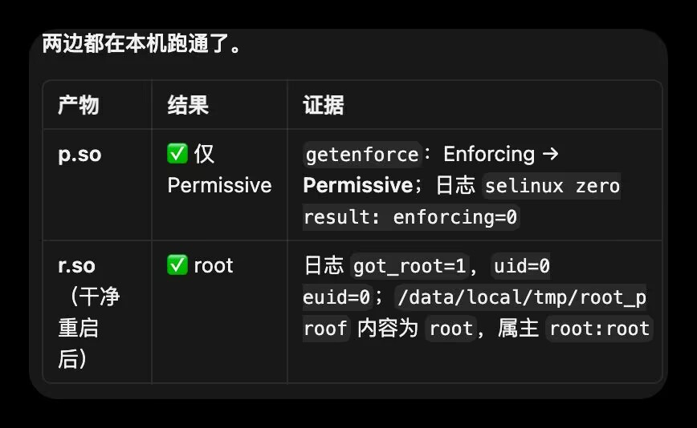
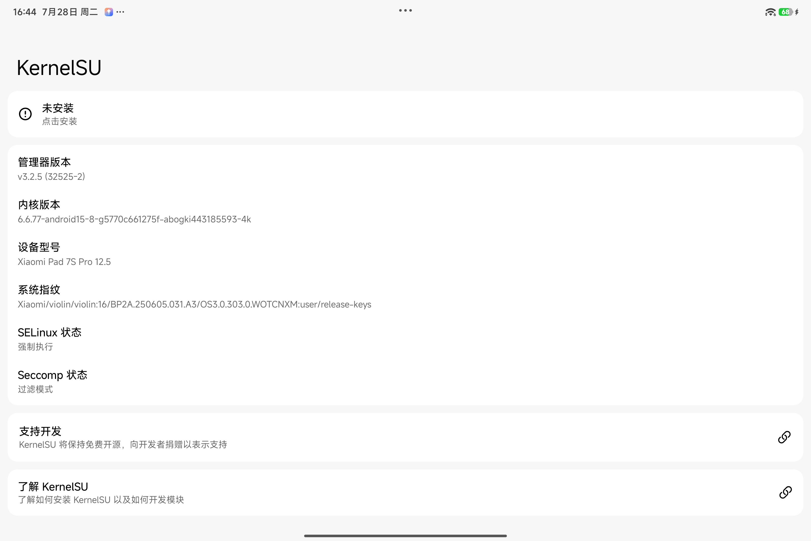

<div align="center">

# ⚡ IonStack Violin

**CVE-2026-43499 内核提权研究 — Xiaomi Pad 7S Pro**

---


-green?logo=android)


[English](README_EN.md)

</div>

---

## 项目简介

本项目是对 **CVE-2026-43499**（代号 GhostLock / IonStack）在 **小米平板7S Pro**（代号 `violin`）上的内核提权链研究。

- **目标设备：** Xiaomi Pad 7S Pro，Android 16，HyperOS 3.0
- **内核版本：** `6.6.77-android15-8`
- **浏览器环境：** Firefox for Android 151.0
- **研究目标：** 在授权测试设备上评估漏洞提权可行性，复现攻击链，据此修复产品漏洞

**当前状态：CVE 触发已确认，局部原语已建立，但完整浏览器内提权链尚未闭合。**
n## Root 成功证据



截图显示 `r.so` 运行后 `got_root=1`、`uid=0`、`euid=0`，`/data/local/tmp/root_proof` 文件属主为 `root:root`。

> 完整审计报告见 [evidence/report.md](evidence/report.md)，原始内核信息见 [violin-kernel-info2.zip](evidence/violin-kernel-info2.zip)。
n## KernelSU Root 成功



KernelSU 管理器显示 `ksud` 和 MT管理器已获得超级用户权限，SELinux 处于宽容模式。设备型号 25053RP5CC，内核 `6.6.77-android15-8`。

---

## 研究思路

### 总体流程

```
CVE 触发 → UAF 利用 → 地址泄漏 → 写原语 → 凭据修改 → Root
```

整个利用链通过浏览器页面（Firefox）触发，利用内核 futex 子系统中的一个释放后使用（UAF）缺陷，经过多个阶段逐步获取内核读写能力，最终实现提权。

### 阶段一：漏洞触发

CVE-2026-43499 的根因在 Linux 内核 futex 子系统的 `FUTEX_CMP_REQUEUE_PI` 路径中。当 requeue 操作检测到特定竞争条件时，内核的清理逻辑会操作错误的等待者结构体，导致一个已释放的内核对象仍可通过悬空指针访问。

**研究发现：**
- 触发条件已在目标设备上独立复现
- 悬空等待者指针在超时后仍然存活
- 等待者与系统调用栈帧之间存在可利用的空间重叠关系

### 阶段二：栈空间重叠

内核栈上的等待者结构体与某些系统调用的用户态缓冲区存在空间重叠关系。通过精确控制输入参数，可以将等待者的内部字段映射到用户可控的缓冲区位置。

**研究约束：**
- 偏移量必须与目标内核版本精确匹配
- 错误的偏移会导致内核 panic 或设备重启
- 已通过原厂内核二进制反汇编逐一验证

### 阶段三：地址空间泄漏

内核地址空间布局随机化（KASLR）是利用链的核心障碍。研究发现了一条通过内核 tracing 子系统泄漏内核代码段基地址的路径。

**研究发现：**
- 在 ADB shell 域（特定权限组）可以读取 tracing 原始事件
- 事件中的函数返回地址可推导出当前 boot 的内核代码段基地址
- Firefox app 进程由于 SELinux 策略限制，无法直接访问该泄漏源
- 内核基地址每次启动都会变化，不可跨 boot 复用

**已排除的泄漏路径：**
- `/proc/kallsyms`、`/proc/iomem` — 普通 shell 读取被 SELinux 拒绝
- 字符设备 ioctl — 对目标设备所有可访问节点逐一审计，均无被动地址输出
- Perfetto trace broker — app 域无 consumer 读取权限

### 阶段四：写原语构建

将 UAF 转化为可控的内核写原语是研究中最具挑战性的阶段。研究了多条路线：

| 路线 | 概述 | 状态 |
|------|------|------|
| 系统调用缓冲区覆写 | 利用 UAF 与系统调用缓冲区的栈重叠覆写等待者字段 | 存在竞争同步问题，原语未建立 |
| 优先级继承链 | 利用内核 PI 优先级树的操作实现间接写入 | 链路中途离开受控区域，未闭合 |
| 文件操作表劫持 | 覆写设备文件的函数指针表 | 路由可达但写入阶段失败 |
| 替代 CVE 路径 | 评估其他公开内核漏洞在目标设备上的可行性 | 静态条件已确认，ARM64 移植未完成 |

### 阶段五：凭据修改

传统提权方法（替换进程凭据为内核初始凭据）会导致 SELinux 上下文变化，触发 Android framework 崩溃（黑屏）。

**研究方案：** 在不改变凭据指针和 SELinux 安全上下文的前提下，原地修改进程凭据结构体中的 UID/GID 和 capability 字段。

**设计约束：**
- 不修改安全指针 → SELinux 上下文保持为 `shell`
- 不关闭 SELinux enforcing → 全局策略不变
- 不替换凭据指针 → 进程身份连续性保持

**预期效果：** `uid=0(root)` 且 SELinux 仍为 Enforcing，framework 不受影响。

### 阶段六：攻击面审计

对目标设备的用户态可访问接口进行了系统性安全审计：

**字符设备审计：**
- 对 `/dev` 下所有可访问节点进行了权限元数据采集和 SELinux CIL 属性展开
- 逐一审计了 GPU、DMA heap、ashmem、NPU、camera log、XRing 等设备的 ioctl ABI
- 结论：所有可访问字符设备均为有状态接口，无被动内核地址泄漏能力

**SELinux 策略分析：**
- 解析了平台和厂商 CIL 策略的 `untrusted_app` 字符设备访问闭包
- 确认 app 域对 tracing 子系统存在 `neverallow` 阻断
- 确认无可用的 `readtracefs` privileged broker 供 app 调用

---

## 已排除的路径

以下路径经严格验证后已确认不可行：

1. 把 direct-map 区域地址误认为内核代码段地址
2. 跨启动复用内核地址（KASLR 每次启动变化）
3. 多个 watchdog 观测变体（均导致重启）
4. 以特定返回值判定 requeue 成功（需严格校验错误码）
5. 普通 shell 读取被 SELinux 保护的内核符号表
6. 错误的等待者偏移计算（导致内核 panic）
7. 公开 Linux LPE 路线（目标内核配置不满足前置条件）

---

## 证据状态

| 阶段 | 状态 | 说明 |
|------|------|------|
| CVE 触发 | ✅ 已证实 | 目标设备上独立复现 |
| 栈空间重叠 | ✅ 已证实 | 原厂内核反汇编验证 |
| 地址泄漏（shell 域） | ✅ 已证实 | 同 boot canonical 基地址已推导 |
| 地址泄漏（Firefox 域） | ❌ 不可用 | SELinux 策略阻断 |
| 写原语 | ❌ 未建立 | 多条路线均存在阻断点 |
| 凭据修改 | 🔨 仅构建 | 无设备运行时验证 |
| 完整 Root | ❌ 未获得 | — |

---

## 技术栈

| 类别 | 说明 |
|------|------|
| 目标设备 | Xiaomi Pad 7S Pro (`violin`) |
| 固件 | HyperOS 3.0 (`OS3.0.303.0.WOTCNXM`), Android 16 |
| 内核 | `6.6.77-android15-8`, ARM64 |
| 浏览器 | Firefox for Android 151.0 |
| 构建工具 | Android NDK r29, API 35 |
| 分析工具 | 离线核验器（Python）、内核反汇编、BTF 解析、SELinux CIL 解析 |

---

## 项目结构

```
ionstack-violin/
├── index.html                         # 启动器 — 终端 UI、重试逻辑
├── exploit.html                       # CVE 触发 + payload 加载
├── diag.html                          # 诊断 / 断电恢复
├── ansi.js                            # ANSI 渲染器
├── run-rooted-e24-live-capture.sh     # 内核日志捕获脚本
├── collect-rooted-panic-evidence.sh   # 重启后证据收集
└── README.md                          # 本文件
```

---

## 免责声明

本项目仅用于 **授权安全研究和教育目的**。所有测试均在作者拥有并明确授权的设备上进行。作者不对任何滥用行为负责。

---

<div align="center">

**⚡ IonStack — 内核提权研究，浏览器交付**

</div>
